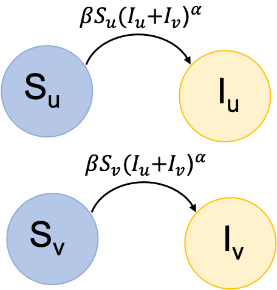
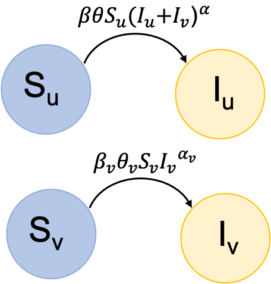

# Specifying compartmental model

We want to allow users to work with a wide variety of infectious diseases or, in our case, one infectious disease under a wide variety of modeling assumptions. To facilitate this, we allow the user to specify their compartmental differential equations model via the configuration file.

We originally considered asking users to specify each compartment and transition manually. However, we quickly found that created long confusing configuration files, and created a shorthand to more tersely specify both compartments and transitions between them.

## Specifying model compartments (`compartments`)

The first stage of specifying the model is to define the infection states (variables) that the model will track. These "compartments" are defined first in the `compartments` section of the config file, before describing the processes that lead to transitions between them. &#x20;

For simple disease models, the compartments can simply be listed with whatever notation the user chooses. For example, for a simple SIR model, the compartments could be `["S", "I", "R"]`. The config also requires that there be a variable name for the property of the individual that these compartments describe, which for example in this case could be `infection_state`

```
compartments:
  infection_state: ["S", "I", "R"]
```

Our syntax allows for more complex models to be specified without much additional notation. For example, consider a model of a disease that followed SIR dynamics but for which individuals could receive vaccination, which might change how they experience infection.&#x20;

In this case we can specify compartments as the cross product of multiple states of interest. For example:

```
 compartments:
   infection_state: ["S", "I", "R"]
   vaccination_status: ["unvaccinated", "vaccinated"]
```

Corresponds to 6 compartments, which the code internally converts to this data frame

```
infection_state, vaccination_status, compartment_name
S,               unvaccinated,       S_unvaccinated
I,               unvaccinated,       I_unvaccinated
R,               unvaccinated,       R_unvaccinated
S,               vaccinated,         S_vaccinated
I,               vaccinated,         I_vaccinated
R,               vaccinated,         R_vaccinated
```

In order to more easily describe transitions, we want to be able to refer to a compartment by its components, but then use it by its compartment name.

If the user wants to specify a model in which some compartments are repeated across states but others are not, there will be pros and cons of how the model is specified. Specifying it using the cross product notation is simpler, less error prone, and makes config files easier to read, and there is no issue with having compartments that have zero individuals in them throughout the model. However, for very large models, extra compartments increase the memory required to conduct the simulation, and so having unnecessary compartments tracked may not be desired.&#x20;

For example, consider a model of a disease that follows SI dynamics in two separate age groups (children and adults), but for which only adults receive vaccination, with one or two doses of one of two vaccine types. With the simplified notation, this model could be specified as  ..

```
 compartments:
   infection_state: ["S", "I"]
   age_group: ["child","adult"]
   vaccination_status: ["unvaccinated", "1dose", "2dose"]
   vaccine_type: ["brand1", "brand2"]
```

corresponding to 12 compartments, 4 of which are unnecessary to the model

```
infection_state, age_group, vaccination_status, compartment_name
S,		 child,	    unvaccinated,	S_child_unvaccinated	
I,		 child,	    unvaccinated,	I_child_unvaccinated
S,		 adult,	    unvaccinated,	S_adult_unvaccinated
I,		 adult,	    unvaccinated,	I_adult_unvaccinated
S,		 child,	    1dose,		S_child_1dose
I,		 child,	    1dose,		I_child_1dose
S,		 adult,     1dose,		S_adult_1dose
I,		 adult,     1dose,		I_adult_1dose
S,		 child,     2dose,		S_child_2dose	
I,		 child,     2dose,		I_child_2dose
S,		 adult,	    2dose,		S_adult_2dose
I,		 adult,	    2dose,		I_adult_2dose
```

Or, it could be specified with the less concise notation

```
compartments:
   overall_date: ["S_child","I_child","S_adult_unvaccinated","I_adult_unvaccinated","S_adult_1dose","I_adult_1dose","S_adult_2dose","I_adult_2dose"]
```

which does not result in any unnecessary compartments being included.&#x20;

These compartments are referenced in multiple different subsequent sections of the config. In the `seeding (LINK TBA)` section the user can specify how the initial (or later imported) infections are distributed across compartments; in the [`seir`](./#transitions-seir-transitions) section the user can specify the form and rate of the transitions between these compartments encoded by the model; in the [`outcomes`](../specifying-observational-model/outcomes-module/outcomes-for-compartments.md) section the user can specify how the observed variables are generated from the underlying model states.

Notation must be consistent between these sections.&#x20;

### Specifying compartmental model transitions (`seir::transitions`)

The way we specify transitions between compartments in the model is a bit more complicated than how the compartments, but allows users to specify complex stratified infectious disease models with minimal code. This makes checking, sharing, and updating models more efficient and less error-prone.&#x20;

We specify one or more _transition globs_, each of which corresponds to one or more transitions. Since transition globs are shorthand for collections of transitions, we will first explain how to **specify a single transition** before discussing transition globs.&#x20;

A transition has 5 pieces associated of information that a user can specify

* source
* destination
* rate
* proportional\_to
* proportion\_exponent

For more details on the mathematical forms possible for transitions in our models, read the [Model Description section](../../model-description.md#generalized-compartmental-infection-model).

We first consider a simple example of an SI model where individuals may either be vaccinated (_v_) or unvaccinated (_u_), but the vaccine does not change the susceptibility to infection nor the infectiousness of infected individuals.&#x20;

<figure><figcaption></figcaption></figure>

We will focus on describing the first transition of this model, the rate at which unvaccinated individuals move from the susceptible to infected state.

### Specifying a single transition

#### Source

The compartment the transition moves individuals _out of_ (e.g., the _source_ compartment) as an array. For example, to describe a transition that moves unvaccinated susceptible individuals to another state, we would write

```
[S,unvaccinated]
```

which corresponds to the compartment `S_unvaccinated`

#### Destination

The compartment the transition moves individuals _into_ (e.g. the _destination_ compartment) as an array. For example, to describe a transition that moves individuals into the unvaccinated but infected state, we would write

```
[I,unvaccinated]
```

which corresponds to the compartment `I_unvaccinated`

#### Rate

The rate constant specifying the probability per time that an individual in the source compartment changes state and moves to the destination compartment. For example, to describe a transition that occurs with rate 5/time, we would write

```
5
```

instead, we could describe the rate using a parameter `beta`, which can be given a numeric value later:

```
beta
```

The interpretation and unit of the rate constant depend on the model details, as the rate may potentially also be per number (or proportion) of individuals in other compartments (see below).

#### Proportional To

A vector of groups of compartments (each of which is an array) that modify the overall rate of transition between the source and destination compartment. Each separate group of compartments in the vector are first summed, and then all entries of the vector are multiplied to get the rate modifier. For example, to specify that the transition rate depends on the product of the  number of unvaccinated susceptible individuals and the total infected individuals (vaccinated and unvaccinated), we would write:

```
[[[S,unvaccinated]], [[I,unvaccinated],[I, vaccinated]]]
```

To understand this term, consider the compartments written out as strings

```
[[S_unvaccinated], [I_unvaccinated, I_vaccinated]]
```

and then sum the terms in each group

```
[S_unvaccinated, I_unvaccinated + I_vaccinated]
```

From here, we can say that the transition we are describing is proportional to `S_unvaccinated` and `I_unvaccinated + I_vaccinated,` i.e. the rate depends on the product `S_unvaccinated * (I_unvaccinated + I_vaccinated)`.

#### Proportion Exponent

This is an exponent modifying each group of compartments that contribute to the rate. It is equivalent to the "order" term in chemical kinetics. For example, if the reaction rate for the model above depends linearly on the number of unvaccinated susceptible individuals but on the total infected individuals sub-linearly, for example to a power 0.9, we would write

```
[1, 0.9]
```

or a power parameter `alpha`, which can be given a numeric value later:

```
[1, alpha]
```

#### Summary

Putting it all together, the model transition is specified as

```
source: [S, unvaccinated]
destination: [I, unvaccinated]
proportional_to: [[[S,unvaccinated]], [[I,unvaccinated],[I,vaccinated]]]
rate: [5]
proportion_exponent: [1,0.9]
```

corresponds to the following math

$$
\frac{\delta \text{S}_\text{unvaccinated}}{\delta t} = - \beta \text{S}_\text{unvaccinated}^1  (\text{I}_\text{unvaccinated}+\text{I}_\text{vaccinated})^{\alpha}
$$

$$
\frac{\delta \text{I}_\text{unvaccinated}}{\delta t} = \beta \text{S}_\text{unvaccinated}^1 (\text{I}_\text{unvaccinated}+\text{I}_\text{vaccinated})^{\alpha}
$$

with parameter and parameter (we will describe how to use parameter symbols in the transitions and specify their numeric values separately in the section [Specifying compartmental model parameters](./#specifying-compartmental-model-parameters)).&#x20;

### Transition Globs

We now explain a shorthand we have developed for specifying multiple transitions that have similar forms all at once, via _transition globs_. The basic idea is that for each component of the single transitions described above where a term corresponded to a single model compartment, we can instead specify one _or more_ compartment. Similarly, multiple rate values can be specified at once, for each involved compartment. From one transition glob, multiple individual transitions are created, by _broadcasting_ across the specified compartments.&#x20;

For transition globs, any time you could specify multiple arguments as a list, you may instead specify one argument as a non-list, which will be used for every broadcast. So \[1,1,1] is equivalent to 1 if the dimension of that broadcast is 3.

We continue with the same SI model example, where individuals are stratified by vaccination status:

<figure><figcaption></figcaption></figure>

#### Source

We allow one or more arguments to be specified for each compartment. So to specify the transitions out of both susceptible compartments (`S_unvaccinated` and `S_unvaccinated`), we would use

```
[[S],[unvaccinated,vaccinated]]
```

#### Destination

The destination variable should be the same shape as the `source`, and in the same relative order. So to specify a transition from `S_unvaccinated` to I`_unvaccinated` and `S_vaccinated` to I`_vaccinated`, we would write the `destination` as

```
[[I],[unvaccinated,vaccinated]]
```

If instead we wrote:

```
[[I],[vaccinated,unvaccinated]]
```

we would have a transition from `S_unvaccinated` to I`_vaccinated` and `S_vaccinated` to I`_unvaccinated`.

#### Rate

Since there are two changes to x a time. The first change we make, is to allow specifying a rate for each component, which are multiplied together. So,

```
[3, 0.6]
```

would correspond to an rate of

```
[3 * 0.6]
```

By itself, this is useless, but we also allow broadcasting of each component:

```
[[3], [0.6,0.5]]
```

This would mean our transition from `S_unvaccinated` to I`_unvaccinated` would have a rate of `3 * 0.6` while our transition from `S_vaccinated` to I`_vaccinated` would have a rate of `3 * 0.5`.

#### Proportional To

The broadcasting here is a bit more complicated. In other cases, each broadcast is over a single component. However, in this case, we have a broadcast over a group of components. We allow a different group to be chosen for each broadcast.

```
[
  [[S,unvaccinated], [S,vaccinated]],
  [[I,unvaccinated],[I, vaccinated]], [[I,unvaccinated],[I, vaccinated]]
]
```

Again, let's unpack what it says. Since the broadcast is over groups, let's split the config back up

into those groups

```
[
  [S,unvaccinated],
  [[I,unvaccinated],[I, vaccinated]]
]
[
  [S,vaccinated],
  [[I,unvaccinated],[I, vaccinated]]
]
```

From here, we can say that we are describing two transitions. Both occur proportionally to the same compartments: `S_unvaccinated` and the total number of infections (I`_unvaccinated+`I`_vaccinated`).

If, for example, we want to model a situation where vaccinated susceptibles cannot be infected by unvaccinated individuals, we would instead write:

```
[
  [[S,unvaccinated], [S,vaccinated]],
  [[I,unvaccinated],[I, vaccinated]], [[I, vaccinated]]
]
```

#### Proportion Exponent

Similarly to rate and proportional to, we provide an exponent for component and every group across the broadcast. So we could for example use:

```
[[1,1], [0.9,0.8]]
```

#### Summary

Putting it all together, the transition glob

```
seir:
  transitions:
    source: [[S],[unvaccinated,vaccinated]]
    destination: [[I],[unvaccinated,vaccinated]]
    proportional_to: [
                       [[S,unvaccinated], [S,vaccinated]],
                       [[I,unvaccinated],[I, vaccinated]], [[I, vaccinated]]
                     ]
    rate: [[3], [0.6,0.5]]
    proportion_exponent: [[1,1], [0.9,0.8]]
```

is equivalent to the following transitions

```
seir:
  transitions:
    - source: [S,unvaccinated]
      destination: [I,unvaccinated]
      proportional_to: [[[S,unvaccinated]], [[I,unvaccinated],[I, vaccinated]]]
      proportion_exponent: [1 * 0.9]
      rate: [3*0.6]
    - source: [S,vaccinated]
      destination: [I,vaccinated]
      proportional_to: [[[S,vaccinated]], [[I, vaccinated]]]
      proportion_exponent: [1 * 0.8]
      rate: [3*0.5]
```

#### Warning

We warn the user that it with this shorthand, it is possible to specify large models with few lines of code in the configuration file. The more compartments and transitions you specify, the longer the model will take to run, and the more memory it will require.

## Specifying compartmental model parameters (`seir::parameters`)

When the transitions of the compartmental model are specified as described above, they can either be entered as numeric values (e.g., `0.1`) or as strings which can be assigned numeric values later (e.g., `beta`). We recommend the later method for all but the simplest models, since parameters may recur in multiple transitions and so that parameter values may be edited without risk of editing the model structure itself. It also improves readability of the configuration files.&#x20;

Parameters can be assigned values by simply stating their numeric value after their name. For example, in a config describing a simple SIR model with transmission rate $$\beta$$(`beta`)= 0.1/day and recovery rate $$\gamma$$ (`gamma`) = 0.2/day. This could be specified as&#x20;

```
seir:
  parameters:
    beta: 0.1
    gamma: 0.2
```

The full model section of the config could then read

```
compartments:
  infection_state: ["S", "I", "R"]
  
seir:
  transitions:
    # infection
    - source: [S]
      destination: [I]
      proportional_to: [[S], [I]]
      rate: [beta]
      proportion_exponent: 1
    # recovery
    - source: [I]
      destination: [R]
      proportional_to: [[I]]
      rate: [gamma]
      proportion_exponent: 1
  parameters:
    beta: 0.1
    gamma: 0.2
```

If there are no parameter values that need to be specified (all rates given numeric values when defining model transitions), the `seir::parameters` section of the config can be left blank or omitted.&#x20;

Parameter values can also be specified as random values drawn from a distribution. In this case, every time the model is run (NOTE slot vs iteration), a new random values of the parameter is drawn. For example, to choose the same value of beta = 0.1 each time the model is run but to choose a random values of gamma with mean on a log scale of $$e^{-1.6} = 0.2$$ and standard deviation  on a log scale of $$e^{0.2} = 1.2$$ (e.g., 1.2-fold variation).&#x20;

```
seir:
  parameters:
    beta: 
      value:
        distribution: fixed
        value: 0.1
    gamma: 
      values:
        distribution: lognorm
        logmean: -1.6
        logsd: 0.2
```

Details on the possible distributions that are currently available, and how to specify their parameters, is provided in the [Introduction to configuration files section](../introduction-to-configuration-files.md#distributions).

